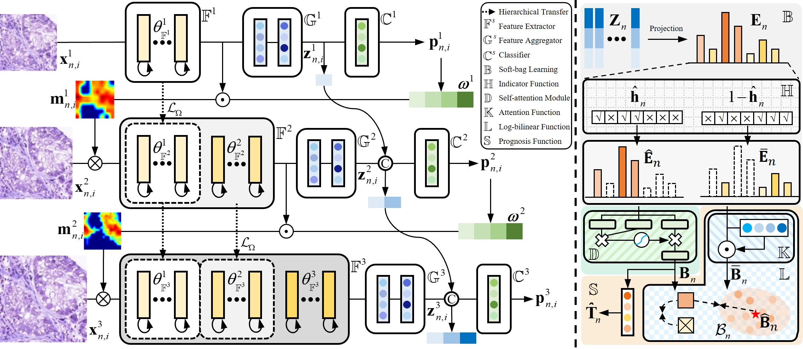

Dual-Curriculum Contrastive Multi-Instance Learning for Cancer Prognosis Analysis with Whole Slide Images [NeurIPS 2022]
=====================================
<details>
<summary>
  <b>Dual-Curriculum Contrastive Multi-Instance Learning for Cancer Prognosis Analysis with Whole Slide Images</b>, NeurIPS 2022.
  <a href="" target="blank">[HTML]</a>
    <br><em><a>Chao Tu</a>, <a>Yu Zhang*</a>, <a>Zhenyuan Ning*</a></em></br>
</summary>

```bash
@inproceedings{tu2022dual,
    author    = {Tu, Chao and Zhang, Yu and Ning, Zhenyuan},
    title     = {Dual-Curriculum Contrastive Multi-Instance Learning for Cancer Prognosis Analysis with Whole Slide Images},
    booktitle = {Advances in Neural Information Processing Systems},
    month     = {},
    year      = {2022},
    pages     = {}
}
```
</details>

## Abstract
The multi-instance learning (MIL) has advanced cancer prognosis analysis with whole slide images (WSIs). However, current MIL methods for WSI analysis still confront unique challenges. Previous methods typically generate instance representations via a pre-trained model or a model trained by the instances with bag-level annotations, which, however, may not generalize well to the downstream task due to the introduction of excessive label noises and the lack of fine-grained information across multi-magnification WSIs. Additionally, existing methods generally aggregate instance representations as bag ones for prognosis prediction and have no consideration of intra-bag redundancy and inter-bag discrimination. To address these issues, we propose a dual-curriculum contrastive MIL method for cancer prognosis analysis with WSIs. The proposed method consists of two curriculums, i.e., saliency-guided weakly-supervised instance encoding with cross-scale tiles and contrastive-enhanced soft-bag prognosis inference. Extensive experiments on three public datasets demonstrate that our method outperforms state-of-the-art methods in this field. The code is available.



<details>
  <summary>
	  <b>Main Contributions</b>
  </summary>

1. **Dual-curriculum Contrastive Multi-instance Learning (DC_MIL) Method.** The proposed method consists of two easy-to-hard curriculums, i.e., saliency-guided weakly-supervised instance encoding with cross-scale tiles and contrastive-enhanced soft-bag prognosis inference. Specifically, We first conduct a preliminary task to learn instance representations by considering risk stratification status (degraded from survival time) as the annotation, followed by the prognosis inference with survival time as supervision.
2. **Curriculum I: Saliency-guidedWeakly-supervised Instance Encoding with Cross-scale Tiles.** It is supervised by the relatively weak annotations so as to reduce label noises and maintain prognosis-related guidance. Additionally, to imitate the reviewing procedure of pathologists, we leverage the low-magnification saliency map to guide the encoding of high-magnification instances for exploring fine-grained information across multi-magnification WSIs.
3. **Curriculum II: Contrastive-enhanced Soft-bag Prognosis Inference.** Instead of enrolling all instances, we adaptively identify and integrate representative instances within a bag (as the soft-bag) for prognosis inference and leverage the constrained self-attention strategy to obtain extra sparseness for soft-bag representations, which can help reduce intra-bag redundancy in both instance and feature levels. Meanwhile, we improve the Cox loss with two-tier contrastive learning for enhancing intra-bag and inter-bag discrimination.
4. **Performance in Cancer Prognosis Analysis with WSIs.** We evaluate the proposed method on three public cancer datasets and extensive experiments demonstrate that our method outperforms state-of-the-art methods in cancer prognosis analysis with WSIs.
</details>

### Train
```python
python main.py
```
### Test
```python
python main.py
```

## License & Usage 
If you find our work useful in your research, please consider citing our paper at:
```bash
@inproceedings{tu2022dual,
    author    = {Tu, Chao and Zhang, Yu and Ning, Zhenyuan},
    title     = {Dual-Curriculum Contrastive Multi-Instance Learning for Cancer Prognosis Analysis with Whole Slide Images},
    booktitle = {Advances in Neural Information Processing Systems},
    month     = {},
    year      = {2022},
    pages     = {}
}
```